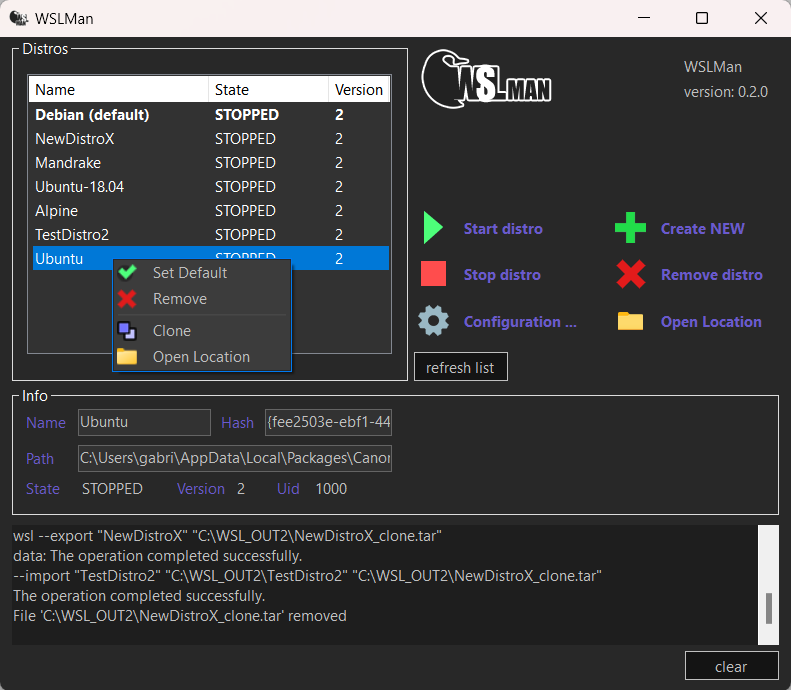
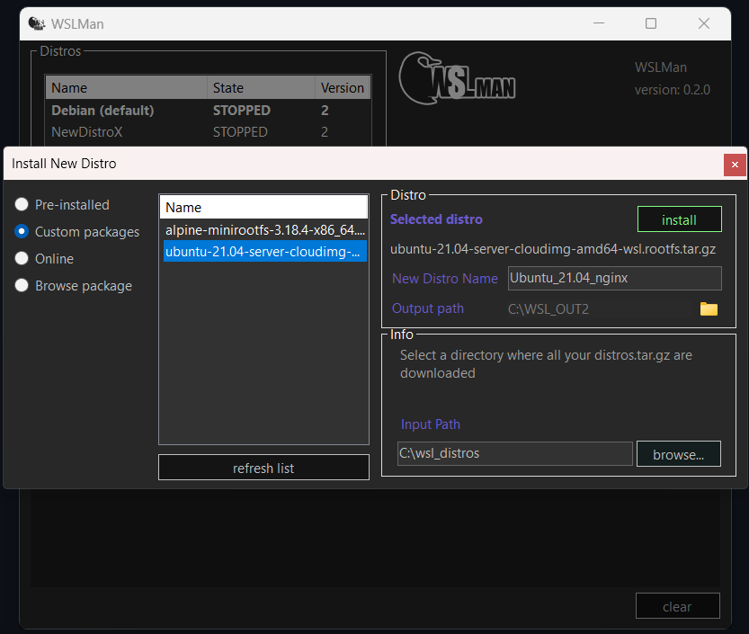
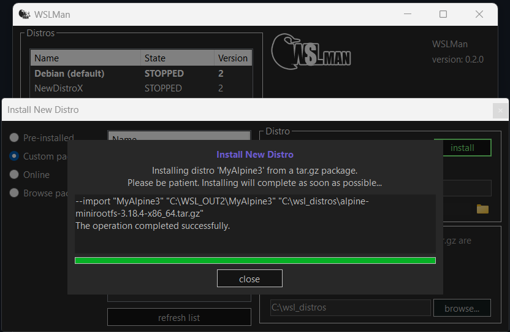

# WSLMan
WSLMan is a WSL manager that facilitates the creation, cloning and general management of Linux distributions on Windows systems.

Its functionalities are:

* List and download linux distros
* Clone machines
* Import third-party distros in tar.gz format
* Customize names
* Create, delete, pause and stop distros
* Other utilities

 

   

   

